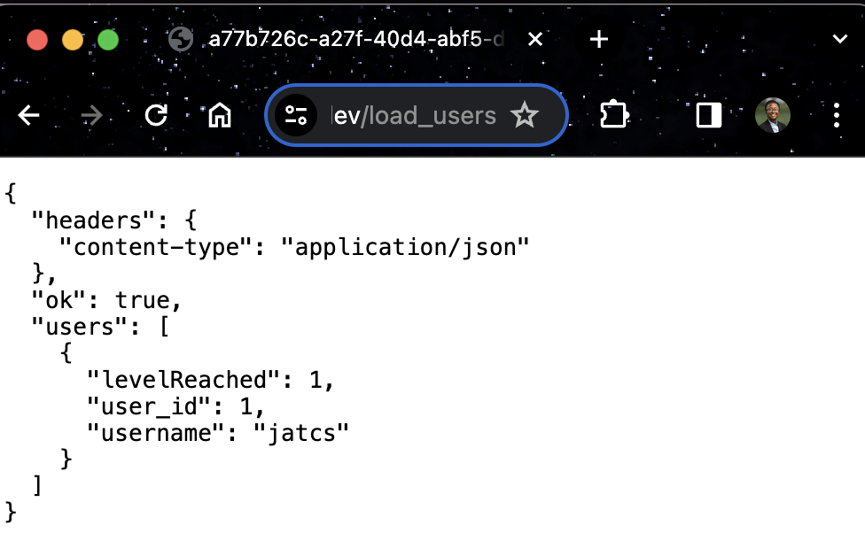
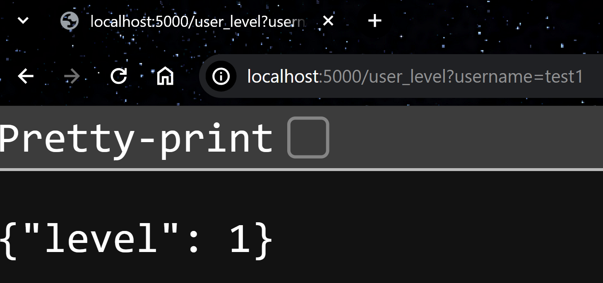

# Backend for "Everest the Olympicat"
This folder contains the source code for our Flask backend!

Scroll down to "Build Instructions" for how to run the app.

# __HTTP Requests__  
The status of each of these implementations is shown by the emojis:
- ✅ = done
- 🟡 = in progress
- ❌ = not started

## ✅ Add/Create user
```
POST add_user
parameter: username 
headers: None required

Returns: json
Example:
    {
        "user_id": 1,
        "msg": "Successfully added user `jess` to database! :D"
    }
```
- Usage: Frontend StartGame page.
- example call: 
    ```
    POST add_user?username=test1
    ```
- ~~Content-type: "application/x-www-form-urlencoded"~~
    - BUG: getting parameter from form returns None when using postman (parameter past in the body). seems to only work within pytest.
- when user presses `[New Game]` and enters their name, send it to the backend to validate and save!

## ✅ Load (read all) users 
(done with first attempt and test, ready to be called!)
```
GET /load_users
```
- Usage: Frontend StartGame page.
    - return the information from the users table so that the frontend can display "save files" (usernames and the levels they reached + maybe their highscore). 
- Response Elements:
    - ok:     boolean
    - users:  list of dicts (rows) each corresponding to a user. Attributes:
        - user_id
        - username
        - levelReached
<figure>
    
    <figcaption>
        Example of a successful GET /load_users request.
    </figcaption>
</figure>


## ✅ Get/check user level
**Note: Updated 4/18 from `/get_level` to `/read_user_level`** 
(not implemented, however you can parse the data from load_users for now)
```
GET read_user_level?username="[username]"
    i.e. GET /read_user_level?username=test1
Return (json)
{
    "levelReached": [1 or 2 or 3],
    "username": [username] (the one you entered),
    "message": [info about result i.e. failure+reason or just success]
}
```
- Usage: Frontend ChooseLevel page.
    - Get the integer value by accessing the key "level"
    - Will be used in Connor's switch statement to determine which levels are disabled
- (i.e. frontend enforces that players can't chose from 2 if they only completed level 1)
<figure>
    
    <figcaption>
        Example of a successful GET /load_users request.
    </figcaption>
</figure>

## ✅ Increment user level
When the user complete's a level successfully POST to this method!

(See `LevelSuccess` use case in our use case document)
```
POST /increment_user_level?username=[username]
    
i.e. POST /increment_user_level?username=jatcs
```
**NOTE: the value of the level only changes if they hadn't yet reached the final level (3).**
- Use "GET /read_user_level" to verify the value of this increment occured as you wished :)
## ✅ Update user score
```
POST increment_score
Params:
- username
- score
```
- score is the score they received on the current level, that is what we will add on to the current score. Basically, you don't have to remember what the previous score was.
- Usage: Frontend LevelComplete page (which gets this information from PlayLevel)

## ✅ Load leaderboard table
```
GET /load_leaderboard
- No params required
- Return: A list of rows to display (example). Currently it returns all the score results.
{
    "rows": [
        {
            "rank": 1,
            "username": "jat101",
            "score": 0
        }
    ]
}
```
- Usage: Frontend ViewLeaderboard page.


# Build Instructions
Before you begin, make sure to install `pip` and `virtualenv`.
Follow the instructions here to do so:
- https://packaging.python.org/en/latest/guides/installing-using-pip-and-virtual-environments/#prepare-pip

You'll only have to run step 1 once, but will repeat steps 2-4 every time you want to run the app.

If you're on linux/bash, you can just run this shell script instead which runs those steps (2-4) for you. 
```
bash run_backend.sh
```

**Note for Mac Users**: If an instruction says Linux or bash, you should be fine to run those on Mac since that terminal uses bash.

## 1. Initialize the virtual environment

You can also find these instructions below on https://packaging.python.org/en/latest/guides/installing-using-pip-and-virtual-environments/

Start from scratch creating your virtual environment by following the python documentation instructions.

Create `.venv` folder by running the following command.
- (Linux) `python3 -m venv .venv`
- (Windows) `py -m venv .venv`

## 2. Load the `.venv` (+ install dependencies for the first time)!
Load the virtual envronment:
- (Linux) `source .venv/bin/activate`
- (Windows) `.venv\Scripts\activate`

Install dependencies by running `pip install -r requirements.txt`
This is how it looks on the linux terminal.
```bash
~/cmsc447-sp2024-himalayans/Backend$ source .venv/bin/activate
(venv) ~/cmsc447-sp2024-himalayans/Backend$ pip install -r requirements.txt
```
Once you have installed the requirements in your virtual environment, you won't have to do this again unless you delete your virtual environment again.

## 3. Run the app!

Every terminal session you do this in, I recommend you initialize the name of the app (see 3.1).

### 3.1 Set the flask app name 
(reference: https://flask.palletsprojects.com/en/1.1.x/cli/ )
- Note: If you are unable to set this environment variable, later instead of doing `flask [COMMAND]` you'll have to do `flask --app flaskr [COMMAND]`. I suggest trying to get this environment variable so you have less to type, especially if you run any of our custom click commands for testing.
```bash
$ export FLASK_APP=flaskr
```
Windows CMD:
```cmd
> set FLASK_APP=flaskr
```
Windows PowerShell:
```powershell
> $env:FLASK_APP = "flaskr"
```

### 3.2 Initialize the database by running this command: 
```bash
flask init-db
```
### 3.3 The command for running/re-running the backend: `flask run`
After you've run that, you can just run and re-run the app without re-initializing the datbase.
```bash
flask run 
```

## 4. Quit the app
   
You can do Cntrl-C usually to exit (break out of `flask run`).

Deactivate the `.venv` by running the `deactivate` command.

# Miscellaneous Notes
General References
- Project Layout modeled after <a href="https://flask.palletsprojects.com/en/2.3.x/tutorial/layout/">Flask Documentation - Project Layout</a>
```
├── flaskr/
│   ├── __init__.py
│   │       Each endpoint is a sub-function in "create_app(...)"
│   │       Todo: GET /create_user, etc. + document
│   │       
│   ├── db.py
│   │       Functions to access the database! 
│   │       
│   ├── schema.sql
│   │       Defines the tables for the "users" and "leaderboard".
│   │       
├── instance/
│   ├── flaskr.sqlite
│   │      This is where all db tables reside after you run `flask init-db`
│   │      
├── tests/
│   ├── conftest.py
│   │      Just a configuration file for pytest. 
│   │      Allows me to access the flask app from each test_*.py 
│   │      
│   ├── test_[endpoint].py
│   │      Contains functions that assert an endpoint is behaving.
│   │      
└── .venv/
            This only appears after you initialize your virtual environment.
            It holds our python interpreter and packages! i.e. "flask", etc.
```

## Interact with the database
If the POST/GET endpoints aren't working, you can add/view the data directly in the sqlite3 terminal. 

See `flaskr/schema.sql` for the table definitions. Notably, we have `usernames` max length of 20 (that's how many characters we store).

Make sure you have `sqlite3` installed 
- tutorial: https://www.sqlitetutorial.net/download-install-sqlite/
- link to download from: https://www.sqlite.org/download.html

Then you can run the instance of the database (assuming you've run `flask init-db`)
- (windows) `C:\sqlite\sqlite3.exe instance/flaskr.sqlite`

(appearance on powershell)
```powershell
PS C:\Users\jturn\Documents\GitHub\cmsc447-sp2024-himalayans\Backend\instance> C:\sqlite\sqlite3.exe .\flaskr.sqlite
SQLite version 3.45.2 2024-03-12 11:06:23 (UTF-16 console I/O)
Enter ".help" for usage hints.
sqlite> .quit
PS C:\Users\jturn\Documents\GitHub\cmsc447-sp2024-himalayans\Backend\instance>
```
- (linux/bash) `sqlite3 instance/flaskr.sqlite3`
```bash
jatcs@JessLaptop:.../cmsc447-sp2024-himalayans/Backend$ sqlite3 instance/flaskr.sqlite 
SQLite version 3.37.2 2022-01-06 13:25:41
Enter ".help" for usage hints.
sqlite> .quit
jatcs@JessLaptop:.../cmsc447-sp2024-himalayans/Backend$
```
## How to contribute:
### Make a new endpoint `flaskr/__init__.py`
Add a subfunction to `create_app`. I recommend using a similar format to the home() function. 

For ease of interpreting the response later on, I have created functions `add_response_success_options(response)` and `add_response_fail_options(response, msg="[default fail msg]")` so that we can consistently interpret the results.
```python
def create_app(test_config=None):
    # ... configuration
    
    @app.route('/')
    def home():
        print("Successfully loaded `/` endpoint!")
        home_response = {"msg": "Welcome to Everest the Olympicat Backend!"}
        add_response_success_options(home_response)
        return home_response

    # ... other endpoints

    # insert your endpoint here!
```

### Make a new database function `flaskr/db.py`

- If you're adding to `db.py` your code will probably look something like this.
    ```python
    def new_func_for_db(parameter):
      """
      Description
      :param parameter: 
          Expected format "xyz"
      :return:
          (on success) _____
          (on fail) None
      """
      db = get_db()
      assert db is not None, "Failed to connect to database."
      NEW_FUNC_SQL = """
          SELECT * from users; -- you replace this with what you actually wanna do
          """
      db_cursor = db.cursor()
      execution_result = db_cursor.execute(NEW_FUNC_SQL)  
      # ^ you might want to fetch data from this.
      return SUCCESS_RETURN_VALUE
    ```
  - (this is mostly a note for myself) Remember, you can only execute 1 sql command at a time using `cur.execute(query)`
  - Additionally, you may want to make an `@click` function so that you can test it without running the app.
  - For example, currently I have this command (`flask drop-db`) so that I can re-initialize (Rerun `flask init-db`)the tables after deleting them (i.e. if I change `schema.sql`)
    ```python
    @click.command('drop-db')
    def drop_db_command():
        result = drop_db()
        click.echo(f'Successfully dropped tables? {result}')
    ```
    ```bash
    (Backend) ~/cmsc447-sp2024-himalayans/Backend$ flask drop-db
    Getting database connection
    Dropped tables.
    Successfully dropped tables? True
    Closed database connection.
    ```
## Our Tests (Using Pytest library)
Inside the virtual environment `(venv)` you can run this command to execute our tests! (Currently there is one for the "/" endpoint and thats it.)

Reference: https://flask.palletsprojects.com/en/3.0.x/testing/

(run pytest without viewing stdout during successful tests)
```
python -m pytest
```
Apparently, by default, `pytest` doesn't display any output it gets when a test was successful (however it will always show during failed tests). 

To see your output, i.e. my "Successfully pinged [endpoint name] " messages from `flaskr/__init__.py`, run it with the `-s` option after pytest.

(run pytest **WITH** viewing stdout during successful tests)
```
python -m pytest -s
```
Reference: https://stackoverflow.com/a/24617813

### My Custom Tests
Run a specific test by typing the test file path after `pytest`. 
For example:
```bash
python -m pytest tests/test_load.py
```

For my reference, when I test an endpoint, I get a `TestResponse` as the result. See this reference link for information about the attributes that can be accessed from those objects.
https://docs.pylonsproject.org/projects/webtest/en/latest/testresponse.html

#### Command line tests (for DEBUGGING)
Additionally, I have the `flask load-db` command to display all the users from the command line.
```bash
(Backend) ~/cmsc447-sp2024-himalayans/Backend$ flask load-users
Getting database connection
Closed database connection.
Loaded users from db:[]
Closed database connection.
```

This way once I implement functionality to add users it'll be easy to display them if I can't get the endpoint to work.

## Running on repl.it
You may have noticed some silly files in the `~/.gitignore`, the reason is because I (@LT69018) did some development on there while my computer has been in the shop.

In the slim chance you are running this app on replit.com
To add the `flask` package in order to run commands like `flask run`, you need to go through the `Packages` and try to install flask through that. Similarly, **Repeat** whichever procedure works for you for each of the remaining packages in `requirements.txt`, if there are any.

That would run a command like this in the Console
```bash
poetry add 'flask ==0.2.10'
```
If it fails i.e. `Could not find a matching version of package flask`, executing that command manually in the Shell without the version worked for me.

```bash
~/cmsc447-sp2024-himalayans$ poetry add 'flask'
Using version ^3.0.2 for flask

Updating dependencies
Resolving dependencies... (4.9s)

Package operations: 7 installs, 0 updates, 0 removals

  • Installing markupsafe (2.1.5)
  • Installing blinker (1.7.0)
  • Installing click (8.1.7)
  • Installing itsdangerous (2.1.2)
  • Installing jinja2 (3.1.3)
  • Installing werkzeug (3.0.2)
  • Installing flask (3.0.2)

Writing lock file
```

Verify you were successfully able to get the requirements by running `pip install -r requirements` in your activated venv.

```bash
(venv) ~/cmsc447-sp2024-himalayans/Backend$ pip install -r requirements.txt 
Requirement already satisfied: ...
...
```
