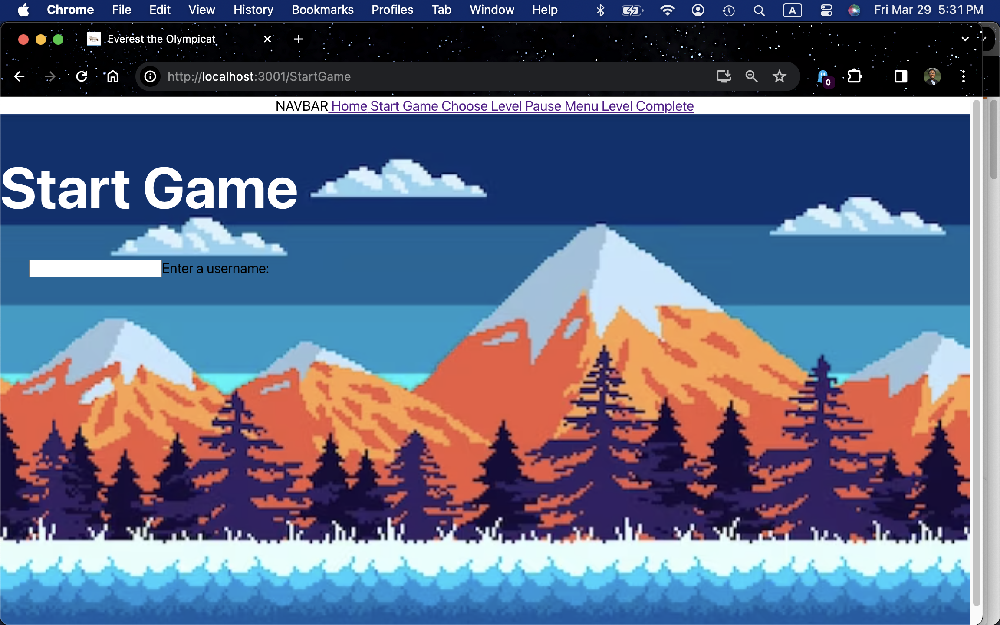

# Everest the Olympicat by "The Himalayans"
Welcome to the Himalayans group (CMSC447-04 Spring 2024) github project repository!

# Sprint 2 - Implementation
## Build Instructions
1. Load the backend by following the instructions in `./Backend/README.md`
2. Render the app by following the instructions in `./Frontend/README.md`.

## Current Progress!
Here is how our application is currently lookin!
You can load the app up and see the the following pages.

Shoutout our awesome team of developers for each of those pages.
- MainMenu: @cmgilger, @LT69018, @David-B-M, @ampham03
- StartGame: @LT69018 
- PauseMenu/LevelFail: @samdev193
- ViewLeaderboard: @ampham03
- LevelExample: @ampham03 
<figure>
    
    <figcaption>Main Menu Screen as of 4-4. ChooseLevel navigates to ChooseLevel page, rest are not functional. Credits - Connor, Jess, David. Moving background as of 4-9 (Credits - Anna).</figcaption>
</figure>

<figure>
    
    <figcaption>Start Game Screen as of 3-29. User input doesn't go anywhere currently. The goal is for them to search through saved games (referenced by their username), delete and load saves, as well as initialize a new save file (with their new username). Credits - Jess</figcaption>
</figure>
For more on @LT69018 intentions with this page, see our whiteboard (which I believe is only accessible for team internal members):
https://miro.com/app/board/uXjVNh35L8s=/?moveToWidget=3458764583679328038&cot=14

<figure>
    
    <figcaption>ChooseLevel screen as of 4-9. Credits: @cmgilger </figcaption>
</figure>

<figure>
    
    <figcaption>LevelExample as of 4-9. Level is playable</figcaption>
</figure>

# Sprint 1 - Design
<figure>
    
    <!-- source: https://www.dreamstime.com/hand-drawn-himalayan-cat-vector-illustration-hand-drawn-himalayan-cat-image131123437 -->
    <figcaption>Current concept of the sprite for the game character!</figcaption>
</figure>

## Game concept
Picture this. 

You're the cute himalayan cat shown above born and raised in the himalayan mountains.

You love to ski and you have your heart set on winning the upcoming winter olympics which are in your very own backyard.
<figure>
    
    <!-- source: https://www.freepik.com/premium-vector/snowy-mountains-fir-trees-starry-sky-pixel-art-game-location-8-bit-retro-backdrop-seamless_36462427.htm7 -->
    <figcaption>Current concept of background landscape!</figcaption>
</figure>

You know it won't be easy, with at least 3 trials of increasing difficulty you have to pass to take home the goal. But you're brave, and are going to give it your best shot.

# Full Product

**Come back on 5/2/2024 to play and compete for the #1 gold medal!**
<figure>
    
    <!-- source: https://www.freepik.com/premium-vector/snowy-mountains-fir-trees-starry-sky-pixel-art-game-location-8-bit-retro-backdrop-seamless_36462427.htm7 -->
    <figcaption>The gold medal you want to win!</figcaption>
</figure>

Feel free to check out our 
<a href="./docs/Use-Case-Document_CMSC447-Himalayans.pdf">Use Case Document</a> 
for more!

# Course Reference
This work is originally created for our Software Engineering I course (<a href="https://www.csee.umbc.edu/cmsc-447-syllabus/">see the CMSC447 website here</a>) in Spring 2024
at <a href="https://umbc.edu/">UMBC</a>
with <a href="https://redirect.cs.umbc.edu/people/faculty/nick-allgood/">Prof. Nick Allgood</a>. 

# Who We Are
You can contact our team at <a>everest-the-olympicat@googlegroups.com</a>

Anna Pham
- Github: https://github.com/ampham03
- Email: apham6@umbc.edu

Jessica Turner
- Github: https://github.com/LT69018
- Email: jturner3@umbc.edu

Connor Gilger
- Github: https://github.com/cmgilger
- Email: cgilger1@umbc.edu

David Middour
- Github: https://github.com/David-B-M
- Email: dmiddou1@umbc.edu

Samuel Oyeneyin
- Github: https://github.com/samdev193
- Email: soyeneyin@umbc.edu

# Notes about our Branches
## Anna's Branch: 
Currently working on an example level using Phaser
    -implemented an endless runner concept
    -created a moving background with a static player
    -created obstacles to avoid and items to collect for points
    -level ends when player hits an obstacle or time runs out
## Jess' Branch: 
Will be where I implement the StartGame and ChooseLevel Page.
- I originally implemented them using classes and custom page switching,
but I was overcomplicating it :p 
- Stashed that code in `backup-frontend-class-components`
- I will pull sam's updated main so that we are both the same page.

Connors Branch:
@LT69018 Todo: add a skeleton HTML page for him to add buttons to.

Main Branch: (what have we all agreed on)
- App that switches between different pages 

## David's Branch:
<figure>
    
</figure>
Worked on the StartGame page GUI.
- button functionality to traverse between pages
- displays current example saved games
- added css file and image for StartGame styling
