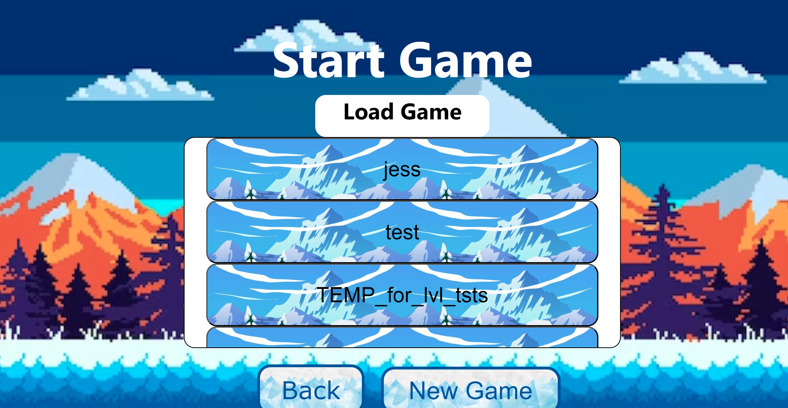
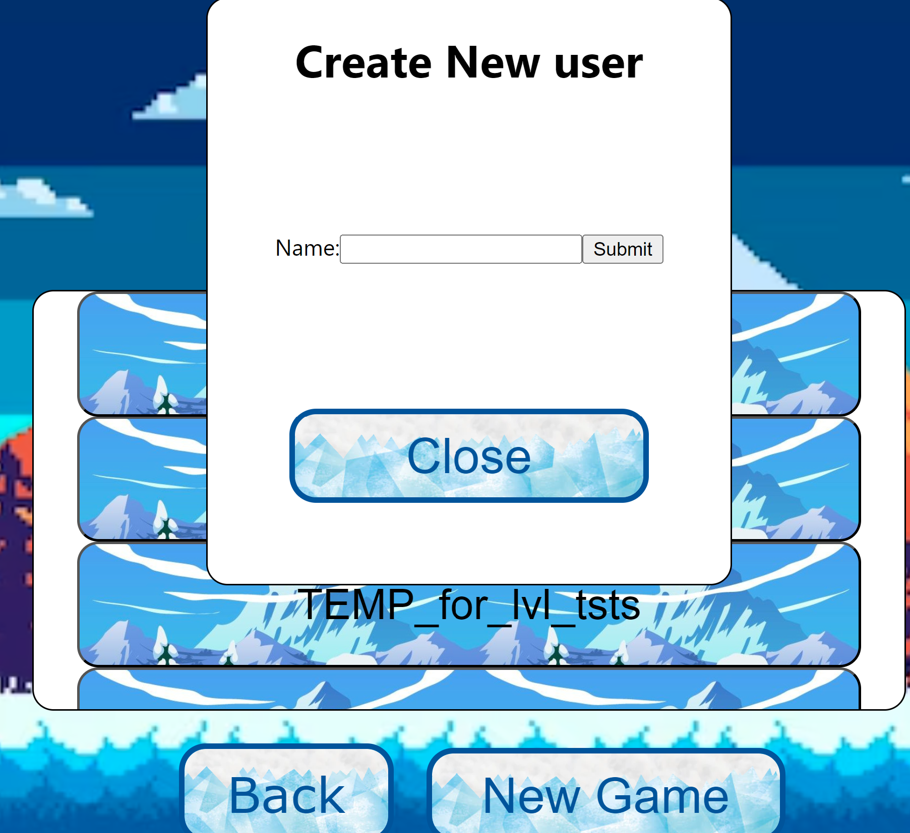
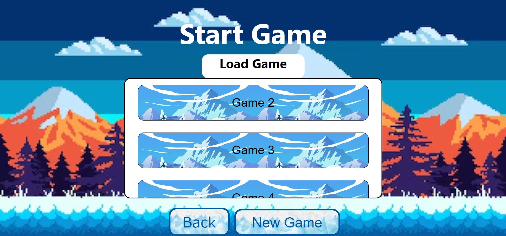

# Everest the Olympicat by "The Himalayans"
Welcome to the Himalayans group (CMSC447-04 Spring 2024) github project repository!

In this README you will find information about our game implementation. (Sprint2 at the top, Sprint1 near the bottom).

**Note for graders - RE: __JIRA__** 

We discussed it with Prof. Allgood and he says that it's alright that we can't give graders access to our JIRA.
We have met the limit for the numbers we can have on our account (since Jess has 2 group projects and 10 members total), so they had to remove everyone besides the team developers to make the JIRA functional.

For your grading purposes, I have made this video of me scrolling through our JIRA:
<a>https://drive.google.com/file/d/1VFnRhCT7ANSImjoMtHHZIpmEcs9y-QfY/view?usp=sharing</a>
- We know this is a software development project becuase there is a backlog, however, as you can see in the video, there is no `Create Sprint` button. So, our team has been using Epics to serve that purpose, although I have not been able to set a usable start and end date for that (i.e. to appear on the timeline).

# Sprint 3 (Finalizing Levels + How-to Play!)

## Build Instructions
1. Load the backend by following the instructions in `./Backend/README.md`. (You won't be able to run )
TLDR: Inside that folder:
- activate a virtual environment (`venv`)
- set the flask app environment variable (`FLASK_APP='flaskr'`)
- Start the backend: `flask run`.
2. Render the app by following the instructions in `./Frontend/README.md`.
- Get Dependencies in `node_modules` (i.e. `npm install`). 
- Run with `npm start`

## Send Leaderboard to Professor API!
There's a button in the top right corner of `MainMenu/page.js` (The Home Screen).
Press that when you have added and played games for 5 users locally :)

## How to Play
### 1. Add/select your username if you haven't already via the `Start Game` page.

<figure>

</figure>
- If this isn't your first time, you can select your username to play!
- if you refresh the page, you'll need to select your username again from that page.

<figure style="display: 'flex'">

<figcaption>
Select a username or create a new one.
Note: <em>Your username must be <= 20 characters!</em>
After you `Submit` your new username, press `Close` and select it from the list.
</figcaption>
</figure>

- You can feel free to create a new username to have your progress associated with a different name on the leaderboard.

### 2. Pick a level via `Choose Level`
### 3. Keep running until the time runs out!

You are a himalayan cat that is great at jumping.

**The point of the game is to avoid obstacles and eat fish along the way to boost your score.**

<figure>

<figcaption>Press Up to jump!</figcaption>
</figure>

If you hit an obstacle before the time runs out => **you lose the level.**

<figure>

<figcaption>Keep an eye on the time!</figcaption>
</figure>

Challenge your friends to start a game with their own username and beat each other on the leaderboard!

# Sprint 2 - Implementation
These two headers `Sprint 2` and `Sprint 1` are mainly for grading and reference purposes.

If you just wanna play, you've prob scrolled down far enough ;)

If you wanna learn more about our team, scroll down to `Who we are` and `Notes about our Branches.`

## Old Progress as of that sprint.
Here is how our application is currently lookin!
You can load the app up and see the the following pages.

To quickstart, either click the `LevelExample` link at the top nap bar of our app, or just go to ChooseLevel then level 1 (the other two levels are still under development). To jump, press the up arrow key. The game will freeze if you hit a rock or when time runs out. Refresh to play again.

See the Use Case Diagram / Use Case document for the general flow of the application. 

Note: currently there is no score saving since the level isn't complete (we don't have a win condition yet).

Shoutout our awesome team of developers for each of those pages as well as @LT69018 and @samdev193 for the flask backend.
- MainMenu: @cmgilger, @samdev193, @LT69018, @David-B-M, @ampham03
- StartGame: @David-B-M @LT69018
- ChooseLevel: @cmgilger
- PauseMenu/LevelFail: @samdev193
- ViewLeaderboard: @ampham03
- Level: @ampham03 
<figure>
    
    <figcaption>Main Menu Screen as of 4-4. ChooseLevel navigates to ChooseLevel page, rest are not functional. Credits - Connor, Jess, David. Moving background as of 4-9 (Credits - Anna).</figcaption>
</figure>

<figure>
    
    <figcaption>Start Game Screen as of 4-9. Credits: David. Currently shows skeleton saves for the user to choose from. This will soon show the actual users that have been saved the the database. Basically allow the user to change "who" they play as, i.e. against their friends on the same computer, if they already saved their name. When they press [New Game] they will be prompted to enter their name.</figcaption>
</figure>

<figure>
    
    <figcaption>ChooseLevel screen as of 4-9. Credits: @cmgilger </figcaption>
</figure>

<figure>
    
    <figcaption>ViewLeaderboard as of 4-9.</figcaption>
</figure>

<figure>
    
    <figcaption>LevelExample as of 4-9. Level is playable. To jump, press the up arrow key. The game will freeze if you hit a rock or when time runs out. Refresh to play again. Credits: Anna.</figcaption>
</figure>

# Sprint 1 - Design
<figure>
    
    <!-- source: https://www.dreamstime.com/hand-drawn-himalayan-cat-vector-illustration-hand-drawn-himalayan-cat-image131123437 -->
    <figcaption>Current concept of the sprite for the game character!</figcaption>
</figure>

## Game concept
Picture this. 

You're the cute himalayan cat shown above born and raised in the himalayan mountains.

You love to ski and you have your heart set on winning the upcoming winter olympics which are in your very own backyard.
<figure>
    
    <!-- source: https://www.freepik.com/premium-vector/snowy-mountains-fir-trees-starry-sky-pixel-art-game-location-8-bit-retro-backdrop-seamless_36462427.htm7 -->
    <figcaption>Current concept of background landscape!</figcaption>
</figure>

You know it won't be easy, with at least 3 trials of increasing difficulty you have to pass to take home the goal. But you're brave, and are going to give it your best shot.

# Full Product

**Come back on 5/2/2024 to play and compete for the #1 gold medal!**
<figure>
    
    <!-- source: https://www.freepik.com/premium-vector/snowy-mountains-fir-trees-starry-sky-pixel-art-game-location-8-bit-retro-backdrop-seamless_36462427.htm7 -->
    <figcaption>The gold medal you want to win!</figcaption>
</figure>

Feel free to check out our 
<a href="./docs/Use-Case-Document_CMSC447-Himalayans.pdf">Use Case Document</a> 
for more!

# Course Reference
This work is originally created for our Software Engineering I course (<a href="https://www.csee.umbc.edu/cmsc-447-syllabus/">see the CMSC447 website here</a>) in Spring 2024
at <a href="https://umbc.edu/">UMBC</a>
with <a href="https://redirect.cs.umbc.edu/people/faculty/nick-allgood/">Prof. Nick Allgood</a>. 

# Who We Are
You can contact our team at <a>everest-the-olympicat@googlegroups.com</a>

Anna Pham
- Github: https://github.com/ampham03
- Email: apham6@umbc.edu

Jessica Turner
- Github: https://github.com/LT69018
- Email: jturner3@umbc.edu

Connor Gilger
- Github: https://github.com/cmgilger
- Email: cgilger1@umbc.edu

David Middour
- Github: https://github.com/David-B-M
- Email: dmiddou1@umbc.edu

Samuel Oyeneyin
- Github: https://github.com/samdev193
- Email: soyeneyin@umbc.edu

# Notes about our Branches
## Anna's Branch: 
Currently working on an example level using Phaser
- implemented an endless runner concept
- created a moving background with a static player
- created obstacles to avoid and items to collect for points
- level ends when player hits an obstacle or time runs out

## Jess' Branch: 
- focused on the backend, implementing and testing flask endpoints that interface with the database of `users` (usernames, level numbers) and scores via the `leaderboard` table
- merge changes with collaborators via main branch (i.e. Sam doing full stack)

## Sam's branch
- full stack development, propose changes and fix bugs there before merging into main.

## Connors Branch:
- Frontend (i.e. `ChooseLevel`) and level play design 
Main Branch: (what have we all agreed on)
- App that switches between different pages 

## David's Branch:
<figure>
    
</figure>
Worked on the StartGame page GUI.
- button functionality to traverse between pages
- displays current example saved games
- added css file and image for StartGame styling
